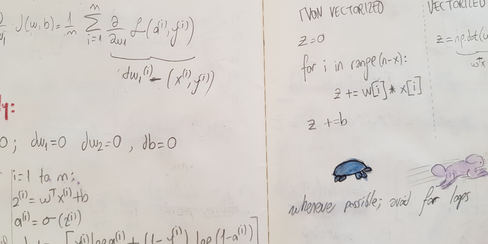

# Machine Learning Notes

## Topics

First digit represents the topic, second digit represent the subtopic.  

- `0` Math, Statistics and Calculus Review
- `1` ML Basics
- `2` Optimization
- `3` Neural Networks
- `4` Convolutional Neural Networks
- `5` RNN Representation
